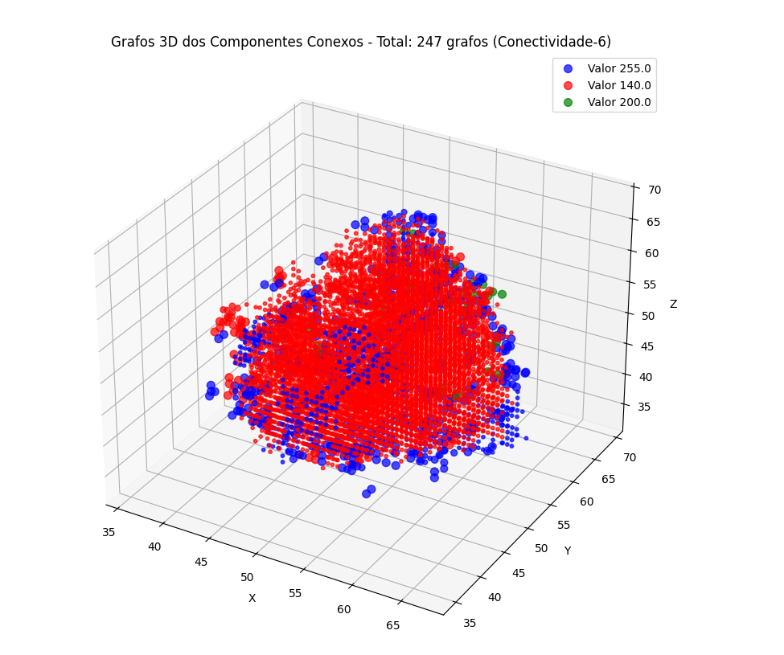
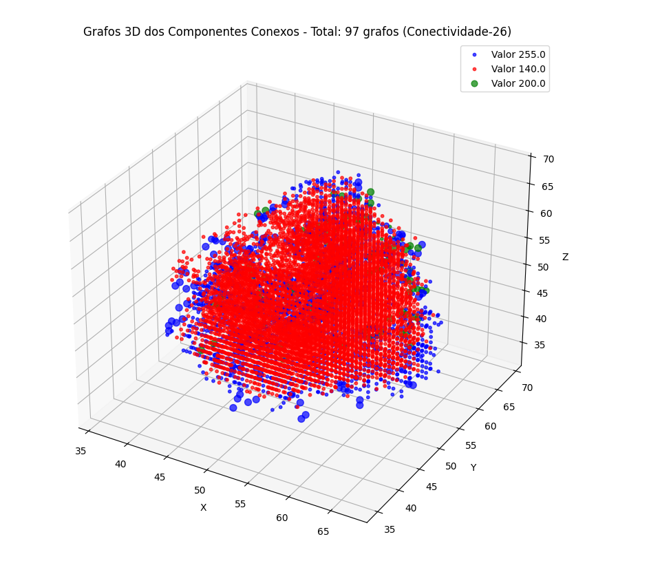

# Segmentação de Volume 3D com Rotulação de Componentes Conexos

Este repositório contém a implementação de um projeto acadêmico para a disciplina de Processamento de Imagens do curso de Ciência da Computação da UDESC (Universidade do Estado de Santa Catarina).

## Objetivo do Trabalho

O objetivo principal foi desenvolver um algoritmo em Python, **sem o uso de bibliotecas de rotulação prontas**, para analisar um volume tomográfico 3D de uma neoplasia. O programa segmenta, quantifica e visualiza três tipos distintos de células (proliferativas, quiescentes e necróticas) com base em seus valores de cinza.

A análise foi conduzida utilizando duas abordagens de vizinhança 3D para entender seu impacto na segmentação:
*   **Conectividade-6:** Um voxel se conecta aos 6 vizinhos que compartilham uma face.
*   **Conectividade-26:** Um voxel se conecta aos 26 vizinhos que compartilham uma face, aresta ou vértice.

---

## Análise Comparativa: Conectividade-6 vs. Conectividade-26

A principal descoberta do estudo é como a **Conectividade-26** oferece uma representação mais coesa e realista da massa tumoral. Ela consegue fundir componentes que a Conectividade-6 via como separados, reduzindo o número total de agrupamentos de **247 para 97** e revelando a continuidade dos tecidos.

| Análise com Conectividade-6 | Análise com Conectividade-26 |
| :---: | :---: |
| *Estrutura fragmentada com 247 componentes* | *Estrutura coesa com 97 componentes* |
|  |  |

---

## Como Executar o Projeto

### Pré-requisitos
Certifique-se de ter o Python 3 instalado. As seguintes bibliotecas são necessárias:

```bash
numpy
matplotlib
networkx
```

### Instalação
Clone o repositório e instale as dependências:
```bash
git clone https://github.com/JoseLaube/Trabalho-1-processamento-de-imagens.git
cd Trabalho-1-processamento-de-imagens
pip install numpy matplotlib networkx
```

### Execução
Para rodar a análise completa e gerar todos os gráficos, execute o script principal:
```bash
python3 main.py
```
O programa irá exibir as estatísticas no terminal e gerar as janelas com os gráficos 3D e os histogramas para ambas as conectividades.

---

## Relatório de Análise (PDF)

Neste repositório, você também encontrará o arquivo **`Relatorio_Analise.pdf`**. Este documento contém toda a fundamentação teórica, a descrição detalhada da metodologia, a análise aprofundada dos resultados, as tabelas comparativas e as conclusões finais do estudo.

---

## Autores

*   **Gustavo de Souza**
*   **José Augusto Laube**
